# PupperCoin Crowdsale

## Crowdsale Smart Contract with Solidity
#

Source: [Pixabay](https://pixabay.com/photos/audience-crowd-event-cheer-945449/)
#

The company has decided to crowdsale their PupperCoin (PUP) token in order to help fund the network development.

The terms of the crowdsale are:

* The crowdsale will run for 24 weeks (for testing purposes we will use Close to be now + 15 min).

* The maximum amount to be raised is 300 ETH.

* The crowdsale will allow users to send ETH and get back PUP (PupperCoin).

* This contract will mint the tokens automatically and distribute them to buyers in one transaction.

* The crowdsale will allow refunds if the crowdsale is successful and goal has been met.

* The contract will be tested on the Ropsten test network. 

### Crowdsale Process 

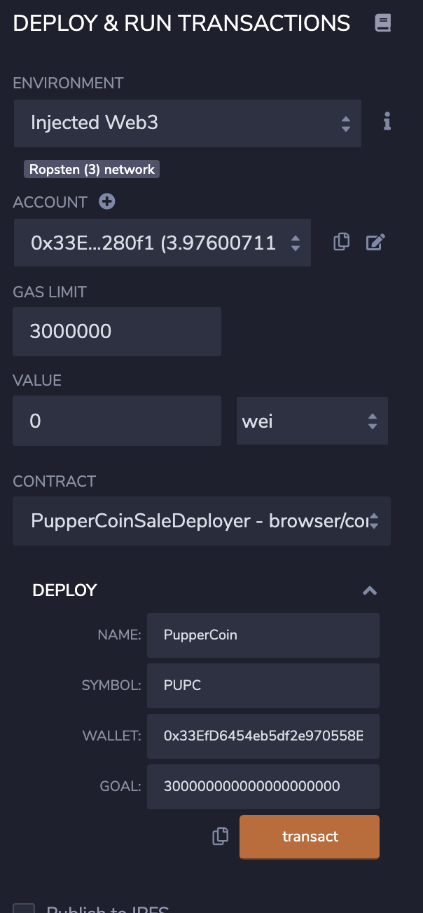

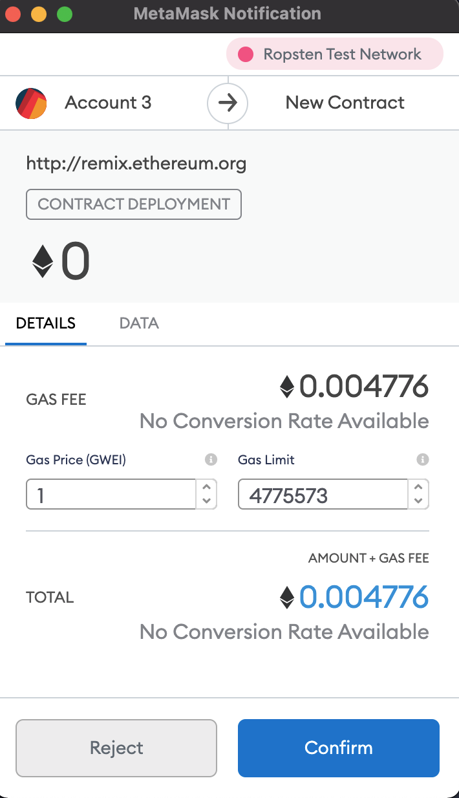

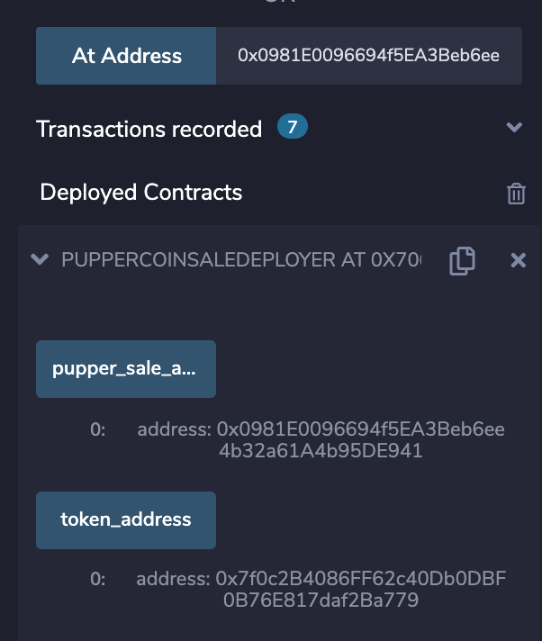

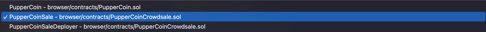

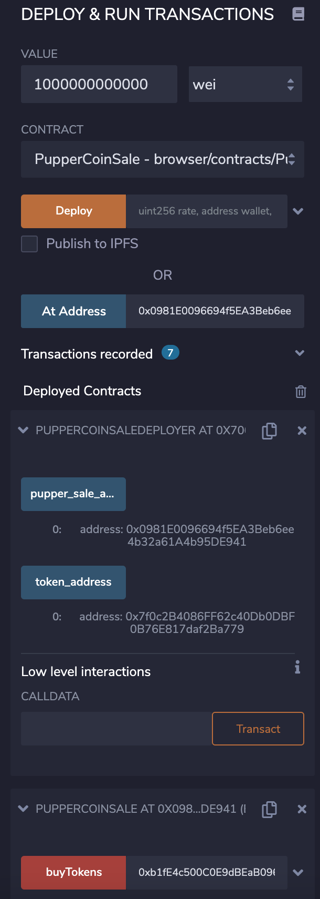

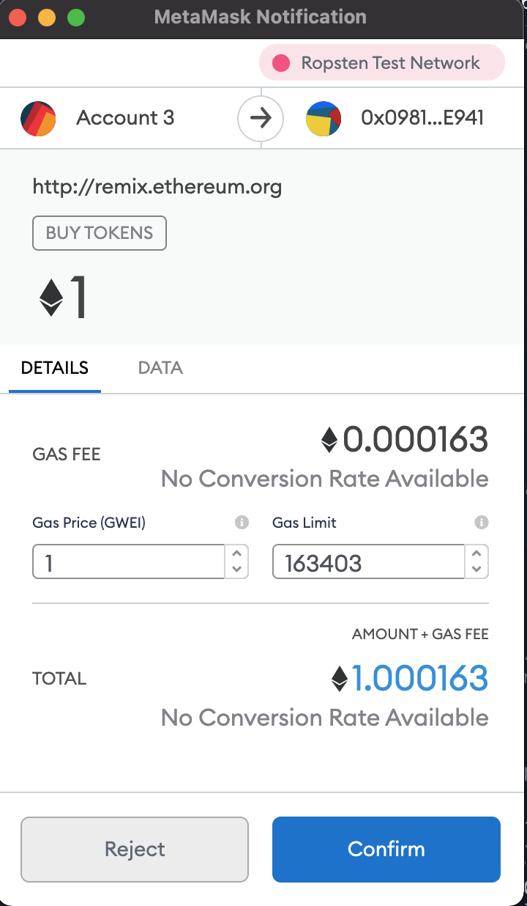

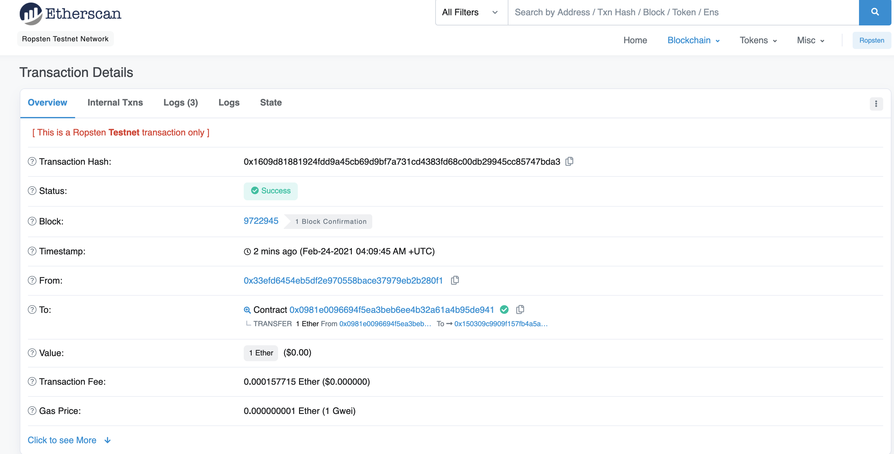

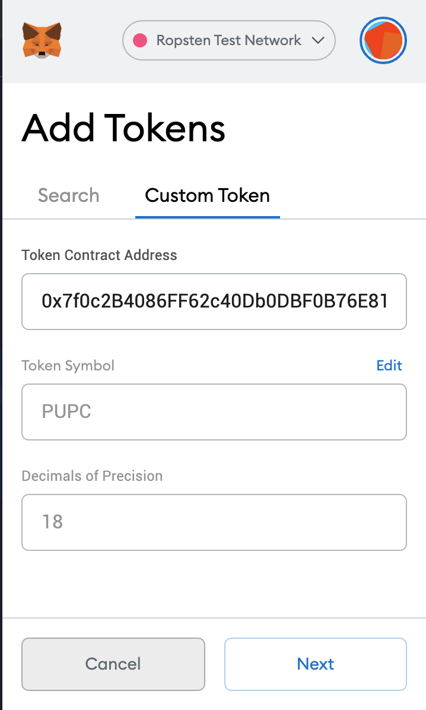

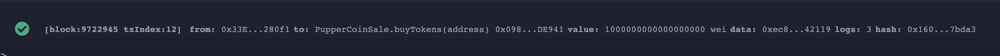

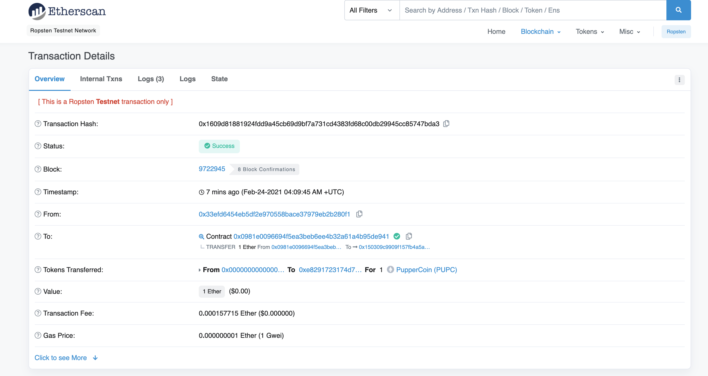

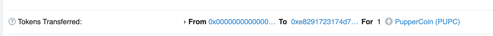

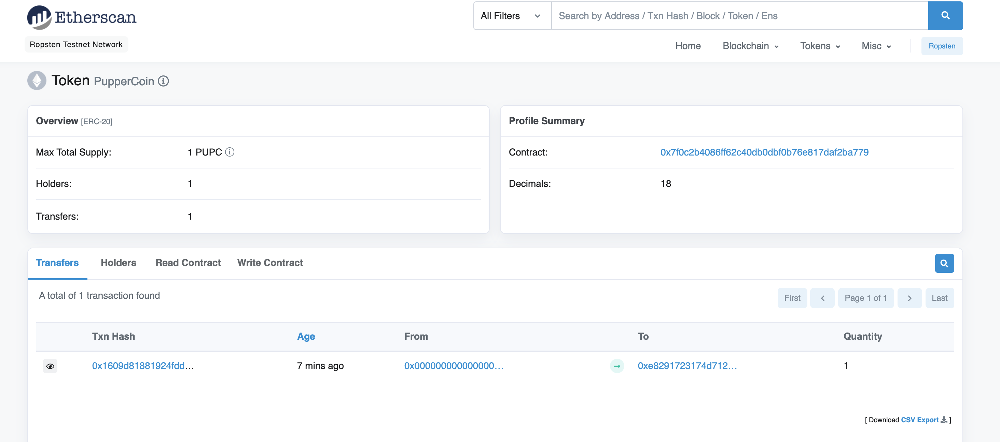

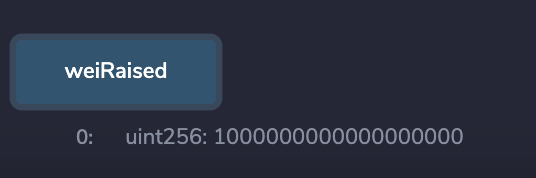

