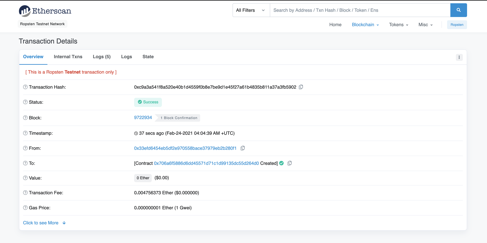

# PupperCoin Crowdsale

## Crowdsale Smart Contract with Solidity

Source: [Pixabay](https://pixabay.com/photos/audience-crowd-event-cheer-945449/)
#

The company has decided to crowdsale their PupperCoin (PUP) token in order to help fund the network development.

The terms of the crowdsale are:

* The crowdsale will run for 24 weeks (for testing purposes we will use Close to be now + 15 min).

* The maximum amount to be raised is 300 ETH.

* The crowdsale will allow users to send ETH and get back PUP (PupperCoin).

* This contract will mint the tokens automatically and distribute them to buyers in one transaction.

* The crowdsale will allow refunds if the crowdsale is successful and goal has been met.

* The contract will be tested on the Ropsten test network. 

#
## Crowdsale Process 

* The first step in crowdsale process is to deploy PupperCoinSaleDeployer contract. Here we also specify the token name, token symbol and wallet that will receive ETH from token purchase as well as crowdsale goal of 300 ETH (equivalent amount in wei).

* MetaMask shows that the new contract will be created on Ropsten test network.

* We can verify on Ropsten test network that contract deployment has been successful. 

* Once we deployed the contract, we are able to see token address and token sale address which we will need to link Deployer contract with Crowdsale contract when transacting ETH to mint and purchase PupperCoin (PUPC) token.

* Next, we input token sale address (pupper_sale_address) and select in drop down menu PupperCoinSale - PupperCoinCrowdsale contract, that is in charge of minting and sending PUPC token to beneficiary. 

* After the Deployer contract link with Crowdsale contract, we can perform a purchase transaction (buyTokens), where 1 ETH is sent to the wallet address. THe crowdsale contract will then mint 1 PUPC token and transfer it to the beneficiary. 

* The transaction is shown in MetaMask where we verify it prior to execution. 

* Upon transaction execution, we can locate it on Ropsten test network, where we verify that it was successful. 

* Aniother way to verify if the transaction has been successful is confirmation message in Remix IDE, where we compiled and deployed the contract. 

* Additionally, we are able to input token contract address to add PUPC token to account via MetaMask.

* The Ropsten test network shows that 1 PUPC token was transferred to the beneficiary in exchange for 1 ETH. 

* Additionally, we can confirm that Crowdsale contract minted 1 token so far, that was transferred to one buyer.

* By interacting with Crowdsale contract in Remix IDE, we can verify that so far 1 ETH has been raised.

#
© 2021 Author: Dragan Bogatic

